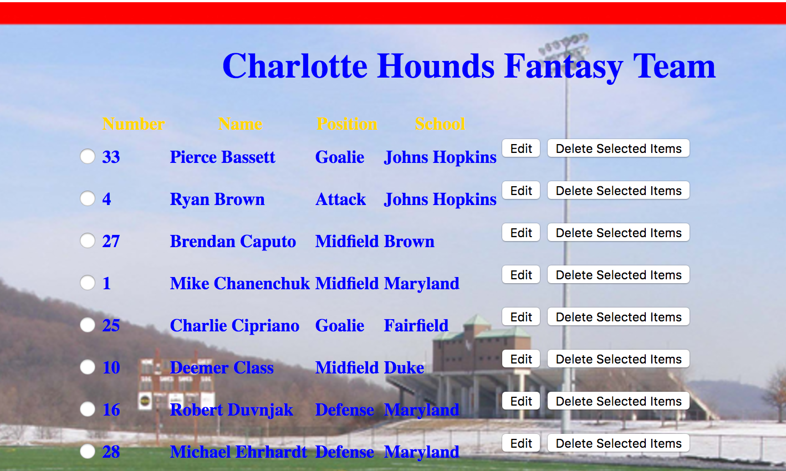
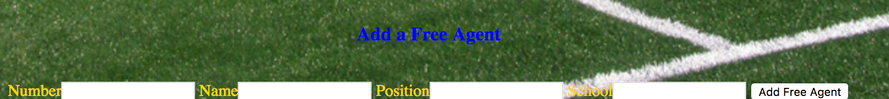

<h1>CRUD-Lacrosse</h1>

<h4> by: Dennis Carrasquillo</h4>

<h1>Summary</h1>

A fantasy lacrosse team management tool made with Java and the Spring MVC framework with CRUD functionality. When using this application you will be able to delete players from the roster using delete buttons. You can edit players as well using the edit button.To add a player to the roster, there are pre-made fields that prompt you for information and allow you to submit the information using a button. The application will then take the information and display the new player on the list.

<h2> Future Goals</h2>

As for future features that I would like to add, there are a couple that I would like to apply to the application. The first would be to allow the user to click on the player themselves which will bring up a player profile with a little bio, stats and player picture. The user would be able to navigate to the previous or next player using previous and next buttons like in the Presidents application. For added free agents there would be a standard blank player picture and no stats. The second feature I would like to add would be every time you clicked on a player, a short highlight video of the player would play before taking you to their bio.

<h2>Trials and Tribulations</h2>

One thing that I had trouble with was with the edit method. When it was first created, it allowed me to edit it just fine but it wouldn't save the changes. With some help I was able to get it to work by creating another edit method that created a new player object based on the changes made from the first edit method. Another thing that I had trouble with was formatting the JSP with CSS. To get everything to work, I had to move the images to a separate file and enclose everything in different div tags.

